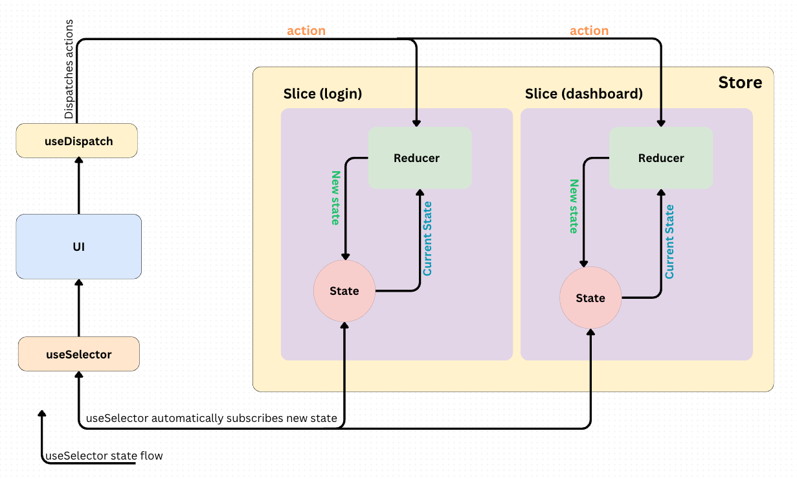

  

  - <ins>**useDispatch**</ins> is used to dispatch actions to the Redux store. It returns the dispatch function from the store, which you can use to send actions to the store. Using useDispatch: When a user interacts with the UI (e.g., clicking a button), the component can dispatch an action to the Redux store using the useDispatch hook. This action represents the intent to update the state.
  - <ins>**useSelector**</ins> is used to access the Redux store's state within a component. It takes a selector function as an argument, which extracts the desired piece of state from the store. The useSelector hook from react-redux automatically subscribes to the Redux store's state updates. Components that need to access the updated state use the useSelector hook. This hook allows them to select the part of the state they are interested in. When the state changes, these components will re-render with the new state.
  - <ins>**Reducers:**</ins> Reducers specify how the state should change in response to dispatched actions. They take the current state and an action as arguments, and return a new state.
    - Reducers are used to update the state in a predictable way based on the type of action dispatched.
    - They should not modify the existing state directly but instead return a new state object.
  - Slices are a feature introduced by Redux Toolkit to group together related reducer logic and action creators for a specific part of the state. They encapsulate the reducer function and action creators for a particular slice of the state.
    - Slices help organize your Redux logic by grouping related reducer functions and action creators together.
    - They provide a convenient way to define reducer logic and generate action creators for specific parts of your application state.
    - By using slices, you can modularize your Redux codebase and make it easier to manage and maintain.